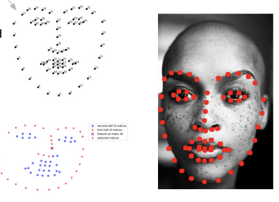
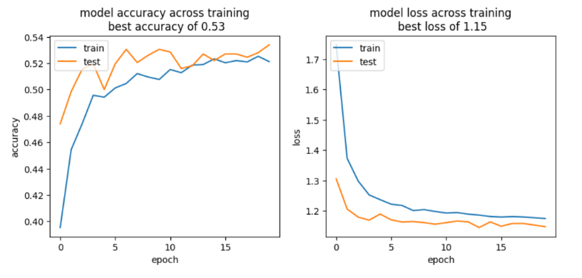
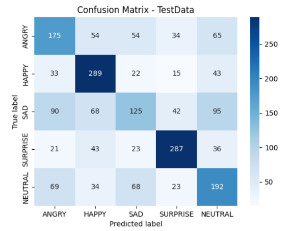

## Abstract
Emotion detection through facial expression analysis has significant applications in various domains such as job interviews, therapy, and healthcare. This research investigates different machine learning (ML) algorithms for Facial Emotion Recognition (FER) using the FER2013 dataset with the goal of identifying the most effective approach. Preprocessing techniques involving landmark detection and Euclidean distance computation were employed to capture spatial relationships within facial features. Decision tree, logistic regression, k-nearest neighbors (KNN), and convolutional neural network (CNN) algorithms were tested, with CNN emerging as the most promising. The CNN model demonstrated superior performance in emotion detection, paving the way for advancements in human-computer interaction and emotional intelligence.

## Introduction
Facial expressions serve as vital cues for understanding human emotions. In recent years, advancements in computer vision and machine learning have enabled automated facial emotion recognition, offering immense potential across various domains. This research explores different ML algorithms to detect emotions accurately from facial expressions, aiming to enhance the capabilities of Facial Emotion Recognition (FER) technology. By investigating the effectiveness of various algorithms using the FER2013 dataset, we strive to contribute to the advancement of emotion detection systems for practical applications such as job interviews, therapy, and healthcare.

## Methods

### Data Preprocessing

The FER2013 dataset was utilized in this study, comprising labeled facial images categorized into seven different emotions. Preprocessing involved the use of dlib to detect 68 facial landmarks, allowing for precise localization of key facial points. Euclidean distance was then computed between these landmarks to capture spatial relationships within facial features, enhancing the discriminative power of the extracted features for emotion detection tasks.

### Machine Learning Algorithms Tested

1. **Decision Tree**: Decision trees were employed as a baseline approach for emotion detection. However, they exhibited signs of overfitting, leading to suboptimal performance.

2. **Logistic Regression**: Logistic regression models were trained to predict emotions based on extracted facial features. Despite their simplicity, logistic regression models struggled to capture the complex relationships within the data.

3. **K-Nearest Neighbors (KNN)**: KNN algorithm was tested to leverage the idea of similarity among data points. However, it demonstrated limited generalization capability, resulting in mediocre performance in emotion detection tasks.

4. **Convolutional Neural Network (CNN)**: CNN emerged as the most promising algorithm for FER. The hierarchical architecture of CNNs allowed them to automatically learn relevant features from raw facial data, resulting in superior performance compared to other tested algorithms.

## Results

### Loss and Accuracy Charts

The loss and accuracy charts depict the training progress of the CNN model. The loss curve shows the decreasing trend, indicating the convergence of the model during training. Simultaneously, the accuracy curve demonstrates a steady increase, reflecting the improving performance of the model in emotion detection tasks.

### Confusion Matrix

The confusion matrix below summarizes the performance of the CNN model in emotion detection:

## Conclusion

This research underscores the importance of machine learning algorithms in Facial Emotion Recognition (FER) technology. By testing different algorithms using the FER2013 dataset, we identified convolutional neural networks (CNNs) as the most effective approach for accurately detecting emotions from facial expressions. The CNN model demonstrated superior performance compared to decision trees, logistic regression, and k-nearest neighbors (KNN) algorithms. Moving forward, further advancements in CNN-based FER technology hold promise for enhancing emotional intelligence and facilitating human-computer interaction in various domains.

## References

- Huang, Z.-Y., Chiang, C.-C., Chen, J.-H., Chen, Y.-C., Chung, H.-L., Cai, Y.-P., & Hsu, H.-C. (2023, May 24). A study on computer vision for facial emotion recognition. Nature News. https://www.nature.com/articles/s41598-023-35446-4 
- Jaiswal, A., Raju, A. K., & Deb, S. (2019). Facial Emotion Detection Using Deep Learning. Facial Emotion Detection Using Deep Learning | IEEE Conference Publications. https://ieeexplore.ieee.org/document/9154121 
- Khare, S. K., Blanes-Vidal, V., Nadimi, E. S., & Rajendra Acharya, U. (2023, September 16). Emotion recognition and Artificial Intelligence: A systematic review (2014–2023) and research recommendations. Information Fusion. https://www.sciencedirect.com/science/article/pii/S1566253523003354 
- Mellouk, W., & Handouzi, W. (2020, August 6). Facial emotion recognition using Deep Learning: Review and Insights. Procedia Computer Science. https://www.sciencedirect.com/science/article/pii/S1877050920318019 

---